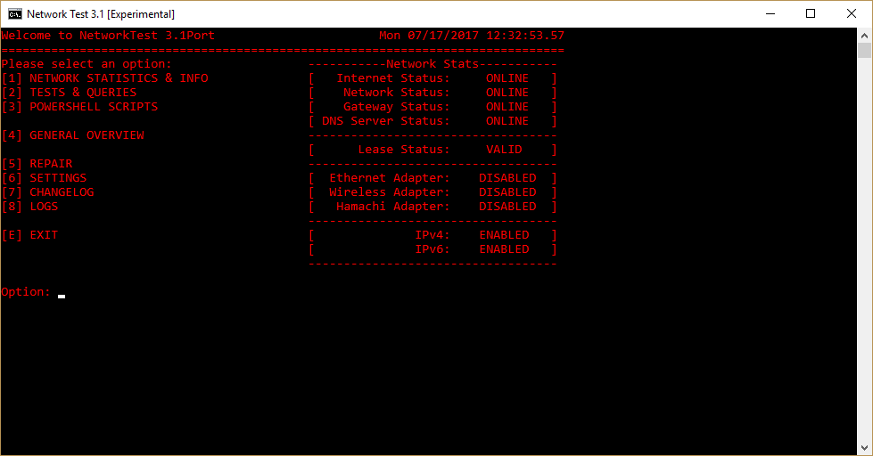
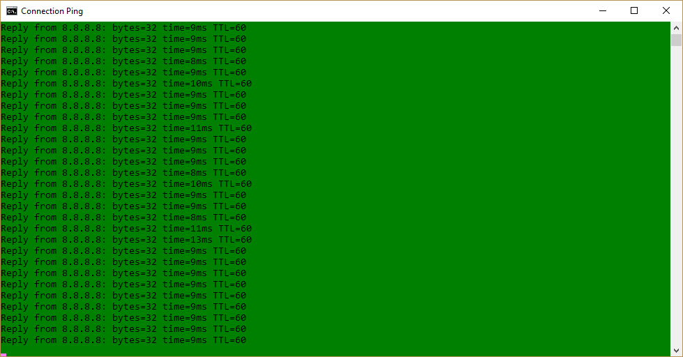
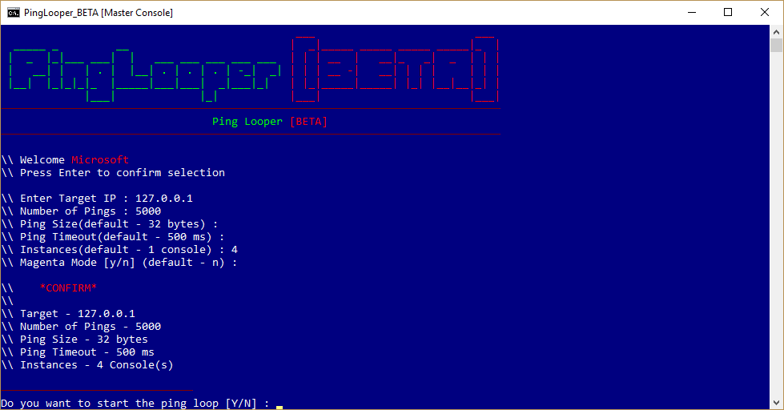
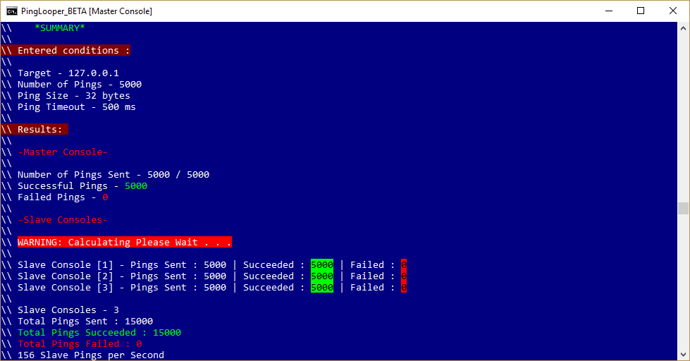
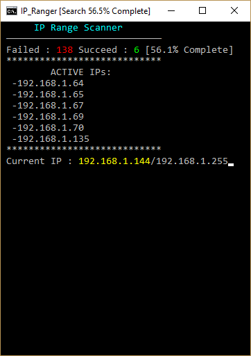
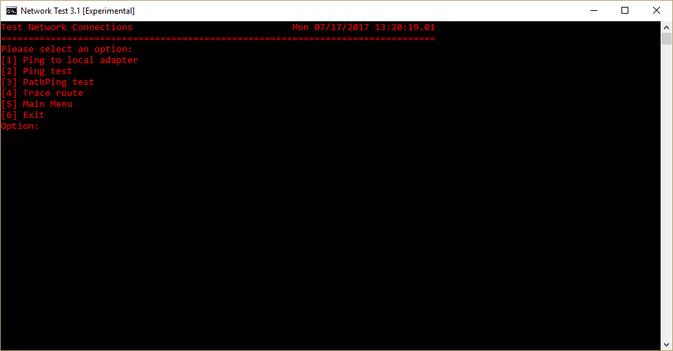
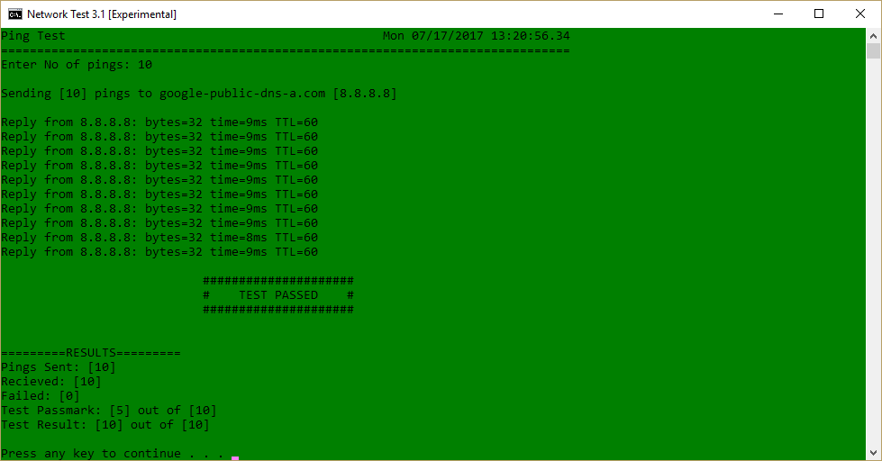

# NetworkTests

 

A small suite of network tools and tests written in Batch and Powershell.

***

# Included Scripts:
- *NetworkTest* - Core and underlying Batch script, all other scripts are initiated from here
- *ConnectionPing* - Simple colour ping script
- *NetDisplay* - A powershell script that displays, in a simple colourful format, the statuses of a computers network components and connections
- *NetRanger* - A small script built using core components from PingLooper, it is designed to scan for IP address on a specified network segment
- *NetLooper* - A script designed to test the connection between computers and servers by using accelerated ping sending from multiple console instances
- *SystemShell* - Incomplete.

# Screenshots

